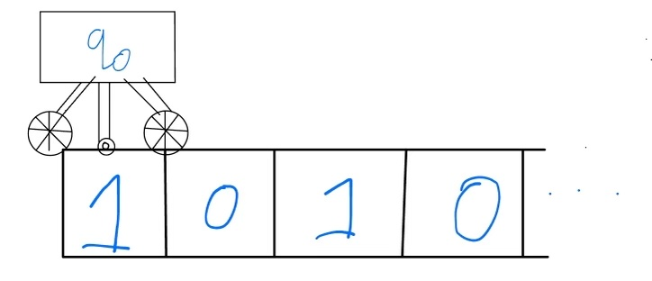
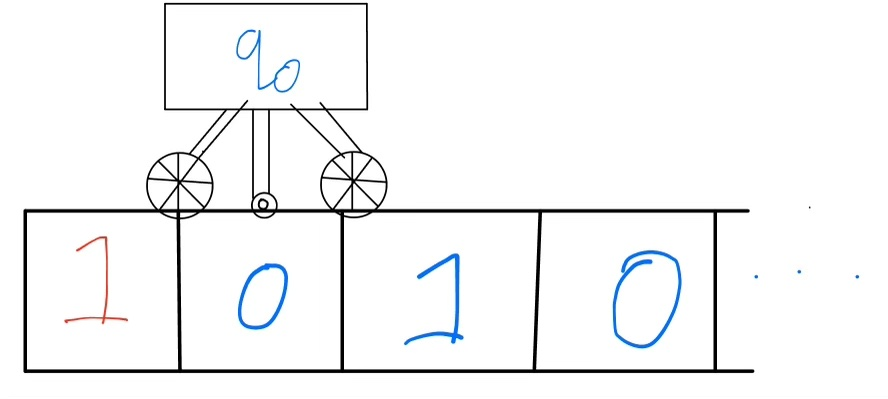
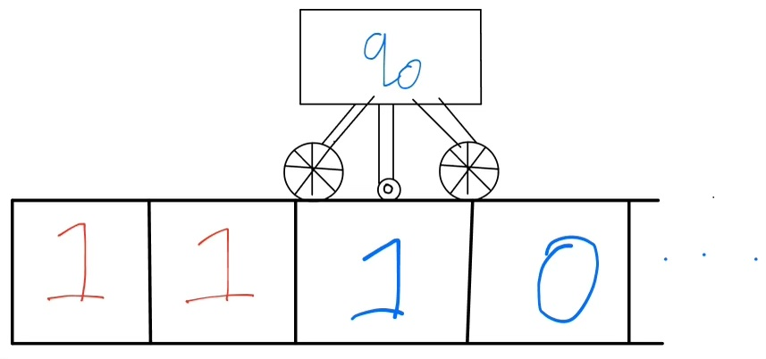
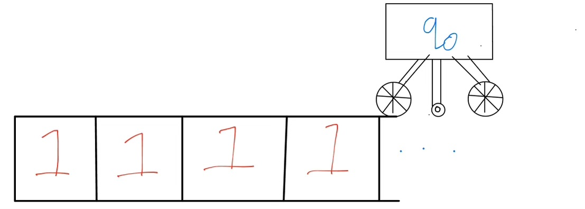
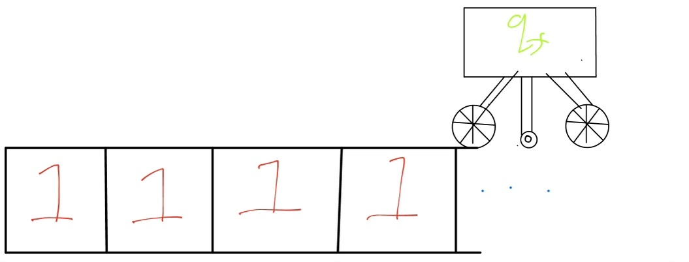
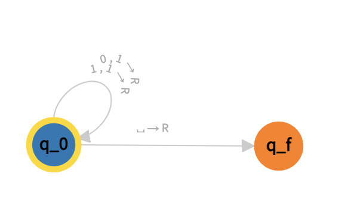
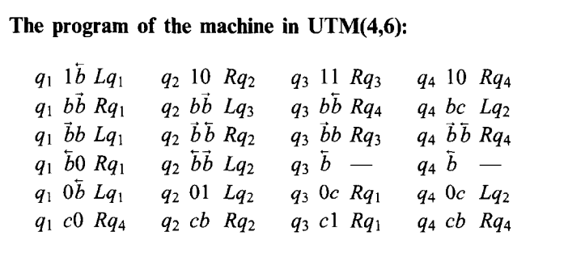

## What is Complexity Theory really?

In Level 1, we saw how computer science was born out of trying to understand the limits of what can be answered by these funny little machines called computers. In this level, we're going to examine the details of these computers a little more closely. The goal is the work up towards the formal definition of the $\mathsf{P}$ vs $\mathsf{NP}$ problem mentioned at the end of Level 1. To do so, you'll need to be comfortable with some basic notation from set theory. You should be able to understand what a statement like $a \in A \subseteq B \cap C$ means. If you can't, check out the little refresher below.

import { Accordion } from "react-bootstrap"

<Accordion >
      <Accordion.Item eventKey="0">
        <Accordion.Header>Baby Set Theory</Accordion.Header>
        <Accordion.Body>
          A *set* is just a well-defined way of talking about a collection of things. If I give you a set, the only questions worth asking are about what it contains. Because a set is a mathematical concept, there can be no ambiguity about whether or not a set contains something. 
          
          Sets are usually written in capital letters like $A, B, C$ and the things inside them are usually written in lowercase letters like $a, b, c$. If a thing $a$ is in a set $A$, it is called an *element* of that set and we write $a \in A$. A set can be defined by writing a list of its elements, e.g. $A = \{a, b, c\}$. Because we only care about what a set contains, the order and frequency of elements is irrelevant and so $\{a, b, c\} = \{c, b, a\} = \{a, a, a, b, b, c\}$. On the other hand $\{a, b, c\} \neq \{a, b\}$ because the latter does not contain $c$.

          Writing a set as a list of elements is only convenient when there are a small number of elements. However, because its a mathematical concept, sets very often contain *infinitely* many elements. This isn't as scary as it sounds: the set of natural numbers $\{0, 1, 2, ...\}$ is presumably already very familiar to you. It is so important that it is given a fancy symbol: $\mathbb{N}$. We can use sets to define others sets by giving a rule for picking out the elements. For example, $\{n \in \mathbb{N}: 0 < n \leq 10\}$ is the same of numbers between 1 and 10. The colon 
        </Accordion.Body>
      </Accordion.Item>
</Accordion>

Simplifcations:
- decision (yes/no) rather than answers
- single tape TM
- binary alphabet

### Turing Machines

Recall that the theoretical computer science is mostly based around playing with the capabilities of this funny imaginary contraption called a *Turing Machine* (TM). In level 1, we worked with an informal definition that basically treated a TM as a little cart whizzing up and down an infinitely long tape according to some pre-defined rules. The TM is given a particular question by writing some input on its tape and then after whizzing around for a while, spits out YES or NO (ideally). In order to probe further, we're going to need a slightly more precise definition. So let's just go for it. The technical definition of a Turing Machine is simply a tuple $(Q, \Sigma, I, q_0, F, \delta)$ where $I \subseteq Q, q_0 \in Q, \delta: Q \backslash F \times \Sigma \to Q \times \Sigma \times \{L, S, R\}$. Happy? No? Let's dive a little deeper:

* $Q$ - set of states. This is the basis of a Turing Machine's programming language and will become clearer with an example.
* $\Sigma$ - alphabet. This is the (finite) set of symbols that may be written on the tape at any point. It must always contain a blank symbol $\square$. Very often, it is assumed for simplicity that $\Sigma = \{0, 1, \square \}$ - called the *binary alphabet*. This contents and size of the alphabet makes no real difference to a TM's abilities because if you're given a TM with a larger alphabet, you can always imagine subsituting a symbol with its binary encoding and producing a TM with a binary alphabet that does exactly the same as the original one. Don't worry about the details of this. Just know you're safe to assume the simplest possibility.
* $I$ - input alphabet. This is the (finite) set of symbols that which the *input* may be written in. Clearly, $I \subseteq \Sigma$ but they may differ because $\Sigma$ contains extra symbols that are useful for intermediate working out. By similar reasoning to above, you can safely assume that $I = \{0, 1, \square\}$.
* $q_0$ - initial state. This is the where the TM begins. Will make more sense with an example.
* $F$ - final states. This the set of states (i.e. $F \subseteq Q$) corresponding to a completed calculation. Once a final state has been reached, whatever is on the tape is considered the output.
* $\delta$ - transition function. This is by far the most important part of a TM's definition. Given a current state it takes in the current tape symbol, spits a new symbol (to write on the tape), a new state and whether to move one position left or right along the tape (or stays in place). Thus it can be described as a function $\delta: Q\backslash F \times \Sigma \to Q \times \Sigma \times \{L, S, R\}$. In fact, it is often simpler to assume $\delta$ is a *partial* function which means it doesn't have to be defined on all pairs of states and symbols. $\delta$ can get very complicated but I will give a simple example below.

And that's it! There's quite a lot of book-keeping about what symbols and letters are allowed, but the interesting part of a TM is all contained in $\delta$. To help see how all these parts fit together, I will explicitly construct a TM that solves the following problem: replace all the 0's on the tape with 1's. This is not a particularly useful or impressive problem but who cares?

For simplicity, let's assume $\Sigma = I = \{0, 1, \square\}$. Now let's construct $\delta$. Intuively, what it will do is write a 1 regardless of the current symbol and then move right one position. So let's write that out:
- $\delta(q_0, 0) = q_0, 1, R$ - if we're in the starting state $q_0$ and read a 0, then stay in $q_0$, write a 1 and move right. 
- $\delta(q_0, 1) = q_0, 1, R$ - same but for reading a 1

Is that it? Let's work through an example to find out. Imagine the tape begins with $1010$. By definition, the TM begins in $q_0$. Here's a (very bad) drawing of the starting situation:

As described, there's a tape containing $1010$ (and then infinitely many blanks) and the head of a TM in state $q_0$ looking at the first tape position. So by definition of $\delta$, the first step should be to rewrite the 1, then move right and remain in state $q_0$. This gives:

Next we'll do the same, replacing the 0:

This will continue until arriving at the end of the tape:

What happens when reading a blank? We are yet to define $\delta(q_0, \square)$ and so the machine would crash. Instead, since we have succesfully arrived at the end of the input, the ideal behaviour would be to simply stop. Thus we define $\delta(q_0, \square) = q_f, \square, S$. Since $q_f$ is intended to be a final state, we must remeber to include $q_f \in F$. Having done so, we get:

Great success! We can summarise this behaviour by saying $M(1010) = 1111$, i.e. on input $1010$, $M$ ouptuts $1111$. A compact way of representing the behaviour of this TM is the following "state machine diagram" which I drew using [this website](https://turingmachine.io/):

### Algorithms

Take a look back at the Turing Machine we just defined but imagine the tape began with $1010101101110101011$, rather than $1010$. Would our little contraption still be able to replace it with all $1$'s? The answer - which should be pathetically obvious - is yes! In fact, even though we designed the machine with only $1010$ in mind, it is capable of rewriting absolutely *any* sequence of $0$'s and $1$'s. Though some of these sequences may be too large to ever be written down in the lifetime of the universe, our machine can *in theory* still handle them. 

I think this is absolutely remarkable. Some finite contraption, produced by my finite mind, is capable of solving infinitely many things. In our example, the problem was an extremely uninteresting one. But that was just for illustration. Imagine we want to add two numbers. Suppose that the numbers are written in *unary* - the number $n$ is simply $1$ written $n$ times - and the input is always given as $n$ ones, followed by a $0$, followed by $m$ ones. To compute $n$ plus $m$ we need to rewrite the tape to contain $n + m$ ones. So here's a sketch of how a TM could solve it: rewrite all the symbols with a $1$ until reaching the first blank (as we did before). Then move left one step and replace the final $1$ with a blank and then finish. I'll let you think about how to modify our old TM to do this. You should also think about why this is a succesful solution to our problem (hint: how many $1$s will be left at the end?)

Once again we have managed to construct a very feeble looking contraption which is nevertheless capable of adding *all* numbers (in this idiosyncratic unary form). The reason this keeps happening is because this is what computers are all about! More precisely, we have discovered an *algorithm* for each of our problems. An algorithm is a list of simple instructions which, when followed, solves a certain problem. Or, in the wonderful words of Kleene "an algorithm is a *finite* answer to an *infinite* question". This sounds like it should be impossible - how could we even comprehened infinite questions, let alone give finite answers? The answer: computers (i.e. the means for executing algorithms)! I like to think of computers as periscopes through the roof of Plato's cave, enabling us to glimpse the infinite, mathematical truth lurking above. In case that somehow floats your boat, here's a bizzare AI generated depiction (the blue periscope is the computer, the sailor is the computer scientist):

You might be wondering, what's the point of a computer being able to give infinitely many different answers? We live in a finite universe so are only ever capable of extracting a finite slice of a computer's knowledge (yes [I mean knowledge](/bonus)). One response is that Turing Machines come from *theoretical* computer science and so the whole point is to study the *theoretical* limit of computers. But I think the more interesting response is that only being able to give a handful of specific answers often feels suspiciously like cheating. Imagine I sold you a calculator but all it could tell you was $2+2=4$. This is indeed a true fact about arithmetic, yet whatever I sold you clearly is not *calculating* anything - it has simply stored the answer like an inanimate post-it note. It wouldn't change much if it could also tell you $213412 + 89532 = 302944$ (ironically I had to get a computer to tell me that). A similar sentiment is expressed in this [clip from Modern Family](https://www.youtube.com/shorts/MHzvbvgqHO4). The point is that a computer is only *computing* something when it has to wait for you to give it an input. Moreover, if there were only finitely many different inputs you could ever ask it, then the computer could simply memorise all the individual answers to each of your possible questions as if it came pre-prepared with a stack of post-it notes. It is only when there are infinitely many different possible inputs that we can be sure a computer is truly computing the answer *on the fly*. And, as I emphasise repeatedly, computer science is all about what can be done on the fly, i.e. dynamic processes.

The point is that computers *do* algorithms. A programmer has a problem that they're too lazy to solve by hand so they design an algorithm and then a computer does it. Problem solved. There's a formal way of capturing this: a problem is a function $f: X \to Y$ and an algorithm for computing $f$ is a Turing machine $M$ such that $M(x) = f(x)$ for every $x \in X$. The previous tangent effectively just says that $X$ should be infinitely large. Technically speaking, $X$ and $Y$ should only contain valid tape symbols (i.e. $X \subseteq I^*, Y \subseteq \Sigma^*$), but often we simply pretend $M$ knows how to handle inputs in its own idiosyncratic way. Another minor point is that is that sometimes $f$ is allowed to be a *partial* function (meaning it is not defined on some inputs), in which case $M$ is usually required to *reject* the invalid inputs - meaning that it outputs a special "NO" symbol (think: [computer says no](https://www.youtube.com/watch?v=x0YGZPycMEU)). There are some particularly relaxed situations where we might allow $M$ to just run forever on invalid inputs. For example, technically the division function $/ : \mathbb{N} \to \mathbb{Q}$ is a partial function because you cannot divide by zero. So maybe you'd want your calculator to say "DIVIDE BY ZERO ERROR" when you try to divide by zero, or maybe you're happy to allow something like [this](https://www.youtube.com/watch?v=s_hbvRTGcUI).

### Universality

All of our examples so far have been extremely dull and all seemingly possible on a calculator, or even an abacus from thousands of years ago. Yet it was computers that changed the world, not calculators. So what's the difference?

The key difference is that calculators solve only one type of problem: addition. If you're really lucky and you've got your hands on a ~*scientific*~ calculator, then maybe you can do square roots and $\sin$ and $\cos$ and whatever. But the point is that there's only a handful of buttons giving you access to a handful of different functions. Computers, on the other hand, are seemingly capable of doing far more things. Not only can they add, but they can manipulate data, process images, run games, connect to the internet and all of the weird and wonderful things that the inventors of the computer could never have conceived of. Rather than requiring a seperate contraption for each of these functionalities, you're able to do them all on a single computer. How? Because of *software*. This was effectively Turing's key realisation all the way back in 1929. What he showed is that there exists a single Turing machine with the power to simulate all other Turing machines. Nowadays we call it the ~Universal Turing Machine~. Warning: this is where things start to get a little trippy.

Just before we go all the way to universality, I want to illustrate that one Turing machine interacting with other Turing machines is very natural. I mentioned earlier that we can safely assume that everything on the tape is written in the binary alphabet. I justified this saying "imagine subsituting a symbol with its binary encoding and producing a TM with a binary alphabet that does exactly the same as the original one". What I really meant is that there is an algorithm for turning a Turing machine with a large alphabet into one with a smaller alphabet. The algorithm works like this: given a Turing machine $M_{LARGE}$ consisting of $(Q_{LARGE}, \Sigma_{LARGE}, I_{LARGE}, q_0, F_{LARGE}, \delta_{LARGE})$. If the alphabet $\Sigma_{LARGE} = \{a, b, c, ..., z \}$, then comb through the transition function $\delta_{LARGE}$ and replace every occurence of $a$ with $1$, every occurence of $b$ with $10$ (binary for $2$), ... and every occurence of $z$ with $11010$ (binary for $26$) to create $\delta_{SMALL}$. Then output $(Q_{SMALL}, \{0, 1, \square\}, \{0, 1, \square\}, q_0, F_{SMALL}, \delta_{SMALL})$. This is tedious, but not complicated. And if you do it correctly then you have an algorithm that translates any Turing machine into a binary-language version that does exactly the same thing!

Since we have defined an algorithm, what's really going on is that one Turing machine is being fed the source code of another Turing machine. Of course, the former does not "know" that it is being fed a Turing machine - it simply sees lists of symbols and a transition function and whatever. To help emphasise the difference between $M$ and its source code, we'll often write $\langle M \rangle$ to mean the source code of $M$ written in some standard format on some tape. So if we call the algorithm above $M_{BINARISE}$, then we have that: 
$$
M_{BINARISE}(\langle M_{LARGE}\rangle) = \langle M_{SMALL} \rangle
$$
Hopefully, you're starting to see the pay-off to have such a precise mathematical definition of a computer. Once everything can be boiled down to some concrete lists of symbols, then there is no difficulty in stretching them however we like.

Now it's time for the Universal Turing Machine. As they, "One Turing Machine to rule them all; one Turing machine to find them; ...". Once again this will be an algorithm whose input is the source code of another Turing machine $M$ (as well as an extra input $x$). Except this time, rather than fiddling around with $M$'s source code, the Universal Turing Machine (let's call it $U$) will simulate $M$ as if it were run on $x$. Then $U$ will output whatever $M$ outputs on $x$. More formally, the aspiration for $U$ is that:
$$
U(\langle M \rangle, x) = M(x)
$$

If you're not confused by this, you're probably extremely sceptical such a $U$ can exist. Nevertheless, it does! In fact, every programming language is basically just a choice of how to design $U$. Once again, there's lots of fiddly details. But the core idea is extremely basic. Recall that, by painstaking definition, all a Turing machine does is whizz around a tape, writing different symbols and updating an internal state. Here's how to simulate this:
1. Create a "virtual tape". The beginning of the input tape will be taken up by $\langle M \rangle$ and $x$. Now mark off a portion to keep track of $M$'s state (starting at $q_0$) and $M$'s current tape position (starting at $1$). Beyond that, mark off a portion for tracking the contents of $M$'s tape by copying $x$ over. 
2. Whizz back to the transition function for $M$. Have a look at what it says to do at $q_0$, given the first symbol of $x$. Update the current state and virtual tape accordingly.
3. Repeat step $2$ until $M$ reaches a final state. Delete everything except the virtual tape, which now contains $M(x)$. 

That's it! The primitive operations of a Turing machine are so basic that we can easily describe an algorithm for simulating them. On the other hand, Turing machines are sufficiently powerful that they can follow any list of basic instructions. Depending on how you look at it, the fact that "follow basic instructions" can be described using basic instructions is either extremely obvious or the single most important observation of the 20th century. This was all quite heavy so let me give some fun examples of different ways people have built $U$:
1. Wikipedia lists some of the smallest known universal Turing machines [here](https://en.wikipedia.org/wiki/Universal_Turing_machine#Smallest_machines). Here's a screenshot of the transition function of one of them - containing only 4 states and 6 symbols. Don't worry if it all looks like meaningless symbols (that's a bit of recurring theme at this point), just keep in mind that those few lines are enough to capture every computation that every computer in the universe will ever perform!

2. Your favourite programming language is a universal Turing machine! (As long as you're willing to provide infinite memory...)
3. Here's a universal turing machine in [Minecraft](https://www.youtube.com/watch?v=1X21HQphy6I)
4. Here's one in [the game of life](https://conwaylife.com/wiki/Turing_machine) - in particular they got the game of life running inside the game of life. In this [one](https://www.youtube.com/watch?v=4lO0iZDzzXk), they get the game of life running in the game of life running in the game of life.
4. Here's one in [DOOM](https://calabi-yau.space/blog/doom.html) - technically just some of the building blocks but decent effort nevertheless.

Hopefully you get the point: everything computer nerds touch turns into a universal Turing machine.

### Limits 

### Efficiency

Layers of understanding:
- right answer
- correct program
- proof of correctness of program
- proof of optimality of program
- smallest proof of optimality of program
- ...

### Regular Languages