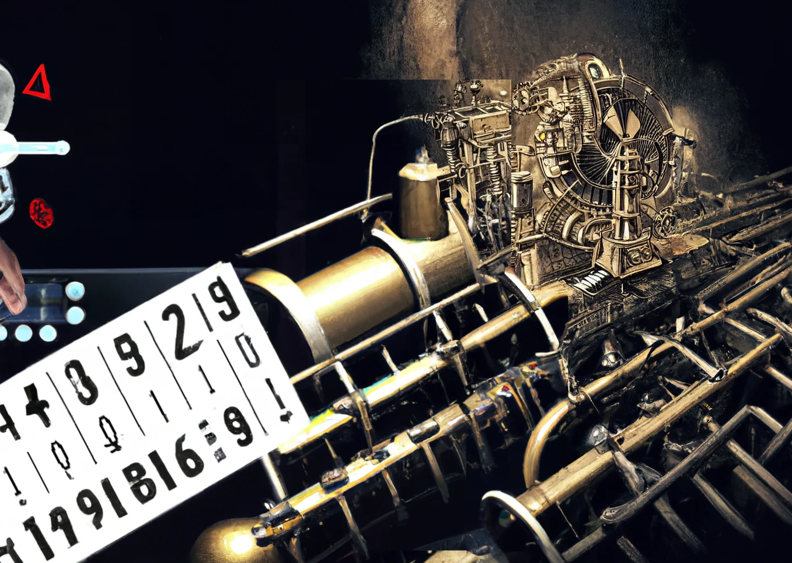

## What is Complexity Theory?

## Contents

- [Easy](#easy)
- [Medium](#medium)
- [Hard](#hard)

<!-- ```toc
exclude: Contents
from-heading: 3
to-heading: 6
``` -->

### Easy

Pre-reqs: 
Audience: 
etc

I'm willing to bet you have a pretty good idea of what a computer is. You're even using one right now! 

We're all familiar with the sorts of things we can do with computers: store files, play games, 

This tutorial gives an informal, historical introduction to  *Computational Complexity Theory* - the study of efficient computation. Periodic table

If you've watched enough crappy Hollywood films, then you'll know computers have something to do with *algorithms*.

To understand, the philosophy and motivation behind this field, let's start with a bit of history. I've embellished some details for your entertainment - if you want to know the real story, go read a book or something.


#### Hilbert's Hubris

It's the roaring 20s. While most of Europe is busy celebrating the end of WW1 and rapidly modernising, its mathematicians - who were mostly oblivious to whole war ordeal - are in the midst of a very different cultural transformation. The philosophy of [Formalism](https://en.wikipedia.org/wiki/Formalism_(philosophy_of_mathematics)) - the idea that maths is essentially just meaningless symbol shunting - has swept blackboards across the continent. More. The main leader of the Formalists was a German mathematician called David Hilbert (it was customary at this time for villains to be from Germany). Hilbert had a grand plan of reducing all of mathematics to a small number of special rules called *axioms*. At which point, he believed it would be possible to know all mathematical truths. His grand plan was known as "Hilbert's Program" and its slogan was "we *must* know, we *will* know". So he was a pretty modest guy. In 1928, Hilbert posed the following challenge:

>Find me a procedure to decide every mathematical statement!

In other words, Hilbert sought a mechanical process that takes in statements and outputs either "true" or "false" correctly, for all possible mathematic statements. You might be wondering what exactly is meant by "mechanical process" and in fact the first step to resolving Hilbert's challenge is to clarify exactly what counts as such a procedure. This is actually why I'm telling this story because it just so happened that a rigorous definition of "mechanical process" accidentally gave birth to the entire field of computer science!

Anyways, back to the story. It's briefly worth considering what the implications would be if Hilbert's challenge were succesful. Firstly, it would indeed mean that all mathematical knowledge was possible. Secondly, it would seem to put all mathematicians out of a job since all symbol shunting could now be outsourced to mechanical robots. While alluring for academic funding bodies, this would be a nail in the coffin for those who believe in the inherent creativity necessary for maths. 

Fortunately, only one year later, Hilbert's program suffered a tremendous blow from a 23 year-old student named Kurt Gödel. In his PhD thesis, Gödel used some mind-bending [paradoxical wizardy](https://en.wikipedia.org/wiki/G%C3%B6del%27s_incompleteness_theorems#First_incompleteness_theorem) to show that whatever set of rules you tried to come up with, as long as they were able to talk about numbers, there would be a true statement that could be neither proven nor disproven. To give you an idea, Gödel's trick was basically to find a way of translating the sentence "this sentence is unprovable" into a statement about numbers!

A few years later, in 1935/36 mathematicians Alonzo Church and Alan Turing independelty built on Gödel's result to finish off Hilbert's program. In both cases, this involved proposing a definition of mechanical procedure and then demonstrating certain fundamental limitations to such procedures. In both cases, such limitations implied that Hilbert's challenge was impossible. This was absolutely devastating for Hilbert's program and the philosophy of Formalism more generally. While some much milder forms continue to exist, this was a real point in favour of the ineffability of mathematical truth. 


#### Turing and the Machines

 It was soon noticed that Church and Turing's seemingly distinct definitions were actually just different ways of talking about the same thing. What was that thing? Nowadays, we call them "computers". You may have heard of them - they literally run the world.

 Turing's definition of a computer is called a [Turing Machine](https://www.youtube.com/watch?v=dNRDvLACg5Q) and is still in popular use today in theoretical computer science. Though I'll leave the fully precise definition for another time, the basic idea of a Turing Machine is something consisting of:
 1. An *infinitely* long tape filled with various symbols
 2. A little machine that whizzes back and forth along the tap
 3. A list of instructions that tell the machine what to do at every point. This conists of reading the symbol at the current tape position then deciding whether to write a new symbol at that position and then whether to move left or right.

 A bizzare AI generated interpretation of how I imagine a Turing machine looks like this:

 

Hope that helps!
### Medium


### Hard